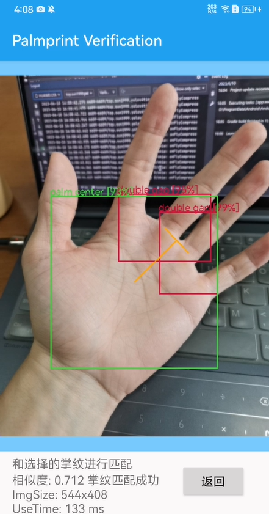
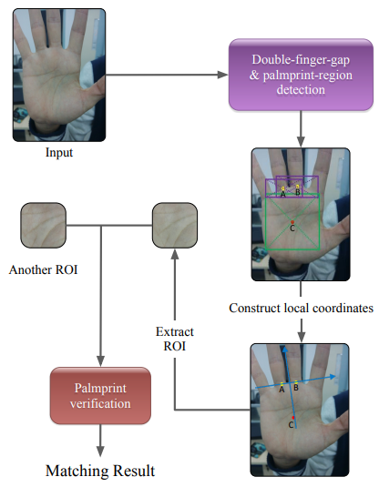
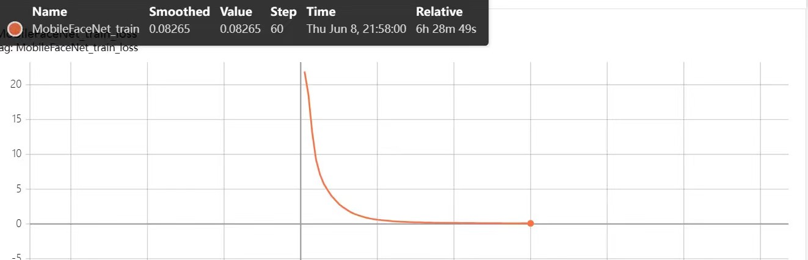
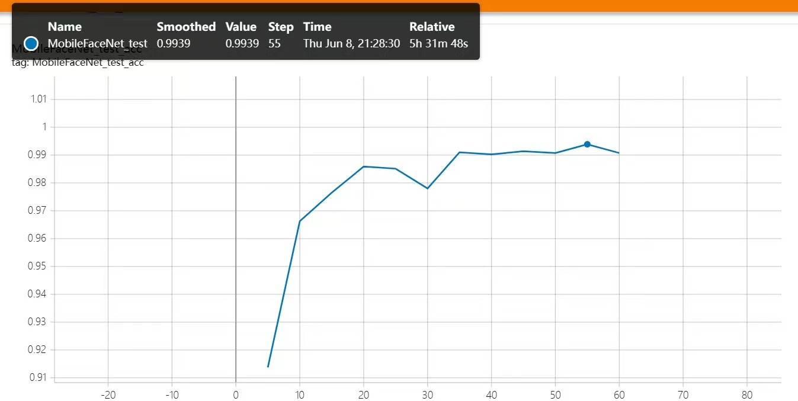
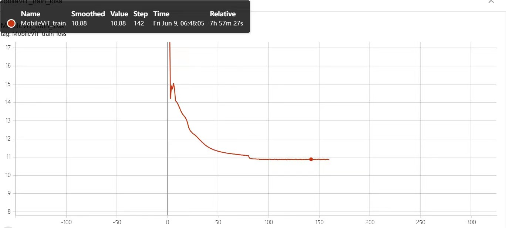
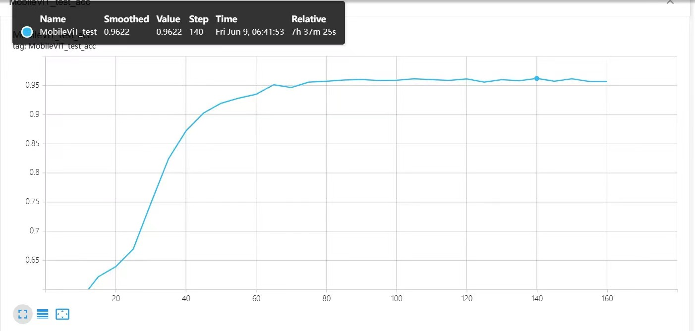
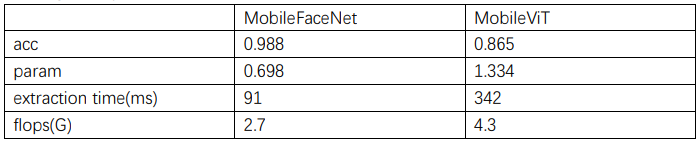

【CV】掌纹识别
===
【写在开头】
---
① 2023spring, 同济大学软件学院机器智能方向专业必修课《计算机视觉》期末项目，  
  课程网站: https://cslinzhang.gitee.io/home/CV/CV.htm  
② 合作者：Zhihua Liu, Jiaqi Lv, Zhenyu Li  
③ 此仓库只包括AI部分的训练与测试代码，不包含APP前后端代码 

【项目概述】
---
① 功能层面：类似于人脸识别，手掌同样包含丰富的生物信息，可以基于掌纹区分人员ID  
② 技术层面：神经网络提取特征，区分特征，从而尽可能加大类间差异，减小类内差异

【效果展示】
---
  

【Tip】
---
这个项目配环境没什么坑，但如果您配环境遇到问题，可以：  
① 注册一个autodl账号，按需租用GPU算力 ***【非广告】***  
② email: 1687107467@qq.com  
  邮件主题：autodl-CV掌纹识别-镜像共享  
  邮件内容：您的autodl账号id

【参考论文】
---
① 《Towards Palmprint Verification On Smartphones》  
这是授课教师一作发表的参考论文，提供本项目的主体思路（详见下文）  
② 《ArcFace: Additive Angular Margin Loss for Deep Face Recognition》  
神经网络提取得到特征张量之后，如何计算当前待检测的特征张量与数据库中已有标签身份ID的掌纹特征这两者之间的“差异”，即如何精确地完成特征匹配？ArcFace论文中给出的损失函数能够有效解决这一问题，实际上ArcFace论文中的损失函数可以视为Softmax的优化版本（详见下文）

【数据集】
---
授课教师实验室团队自制的MPD掌纹数据集
链接：https://pan.baidu.com/s/1pw2MEpACXiYvxVqJ8kmU2Q?pwd=fkc3 
提取码：fkc3 

MPD ROI数据集包含来自200人的400只手的16000张图像（每只手40张图像），本项目按照4:1的比例将MPD ROI数据集分为训练集和测试集。

【技术细节】
---
  
① yolov4检测3个特征点：中指和无名指的指根关节点+掌纹中心点，以便根据这3个点建立有方向性的坐标系并确定ROI(Region of Interset)区域  
  （方向坐标系的作用：例如同一个人的同一只手顺时针旋转90度这样的场景）  
② MobileFaceNet或MobileViT基于ROI区域的图像提取特征张量，进行特征匹配，损失函数采用ArcFace  
  关于ArcFace损失函数：  
  1.权重矩阵和特征张量的乘积(Wx)本质可以理解为向量的点乘，而向量的点乘可以表示为向量摸的乘积再乘向量夹角的余弦值，再配合L2归一化，即可将原来Wx+b的形式转化为s*cosθ的形式(s可以理解为一项尺度因子，因为现在的特征向量分布在半径为s的超球体上)  
  2.对于在原有的权重向量和特征向量的夹角之外额外引入一个惩罚角m，即cos(θ+m)，从而使得损失函数在数学性质上更好地减小类内差距，增大类间差异  
③ 在测试集上进行10折交叉验证  
④ 此外，为了确定一个合适的阈值，从0到1的每隔0.001生成一个阈值，即共1000个阈值数，并分别计算每个阈值下对应的精度结果。最后，我们选择了9个最佳阈值数的平均值。不得不说，这很耗时，但很有效

【Tensorboard可视化训练&测试过程】
---
① MobileFaceNet_train  
   
  
② MobileFaceNet_test  
   
  
③ MobileViT_train  
   
  
④ MobileViT_test  
   
  

【结果数据】
---
 

【写在最后】
---
① 不一定网络结构越复杂效果越好，MobileViT的网络结构复杂程度大于MobileFaceNet，但从本项目的结果来看，MobileFaceNet明显在本项目中效果更好，而且从实际搭载在meta20的效果来看，Yolov4+MobileFaceNet也能达到实时效果；  
② 课程网站 (https://cslinzhang.gitee.io/home/CV/CV.htm) 中对于角点检测、相机标定等计算机视觉基础知识具有很详细且深刻的介绍。
