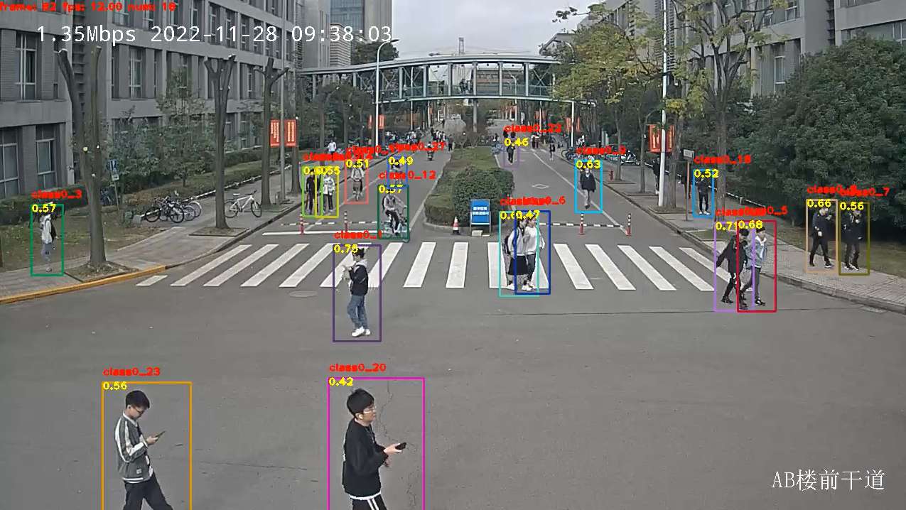
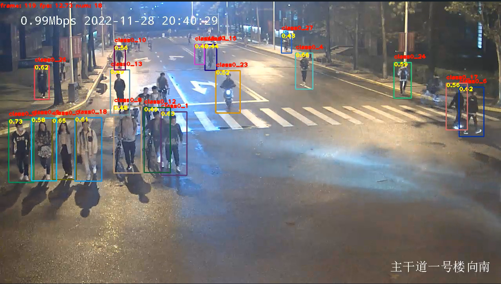
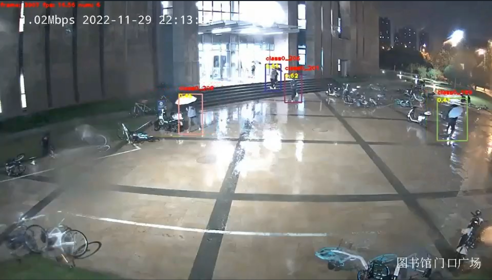
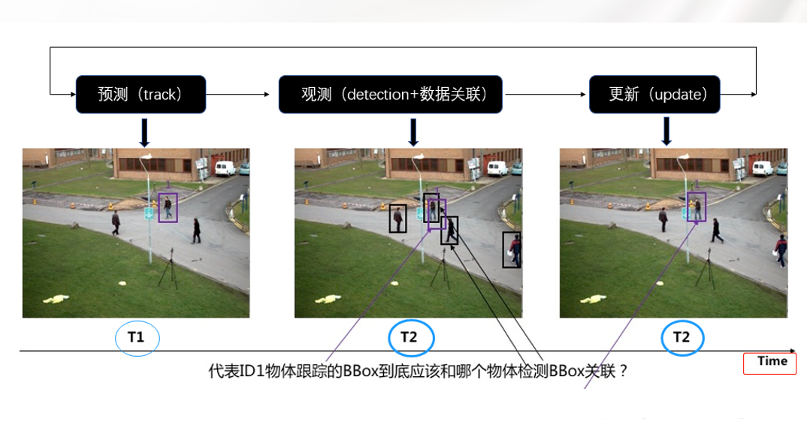
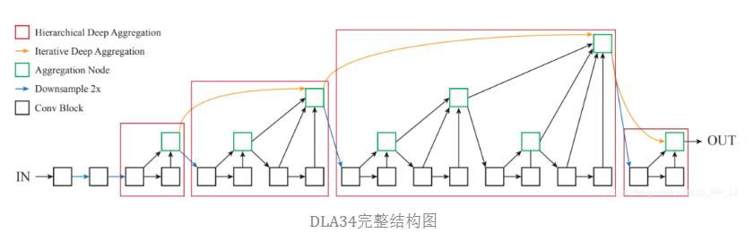
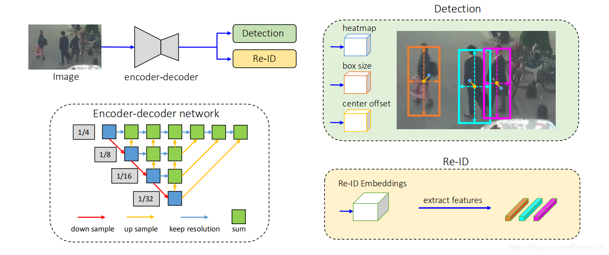
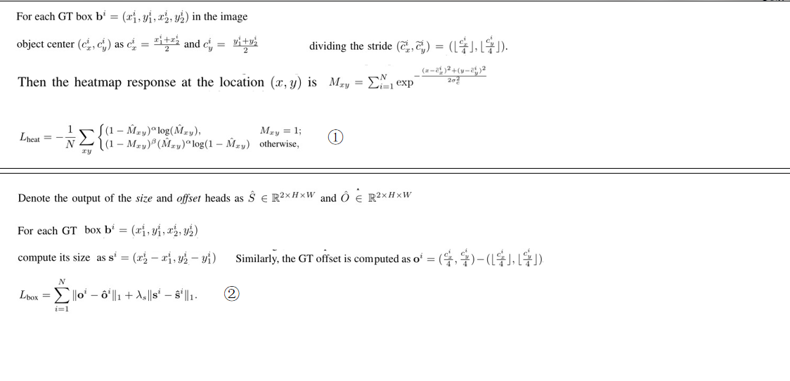
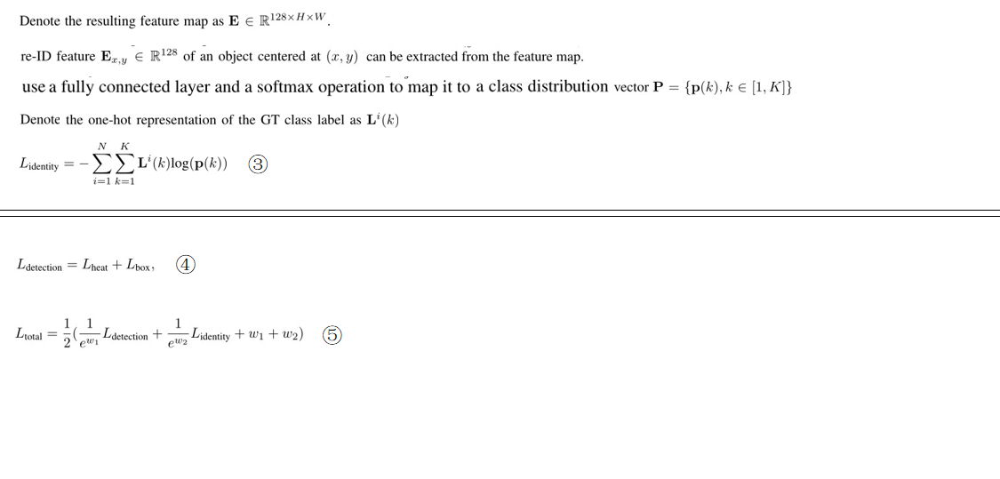

【FairMOT】同济校园监控场景下的多目标追踪
===
【写在前面】
--
① 22fall，此项目作为【MTL】计算机视觉+多功能监控安防项目的前置子项目  
② 偏向于论文调研，原理理解，此处的FairMOT原理部分与CenterNet论文原理重合较多，  
  因为FairMOT约等于在CenterNet的基础之上添加了一个简单的头网络+多目标追踪领域典型的卡尔曼滤波&匈牙利算法  
③ 实践部分主要为同济校园监控视野下数据集的制作  
④ 实验验证FairMOT是否适用于监控视野下，人数较多且画面中行人尺度偏小的特点

【效果展示】
---
① 白天，人数较多  
  
  

② 夜晚，人数较多  
  
  

③ 雨天夜晚，雨伞遮挡，画质变差  
  
  

【原理详解】
---
一、MOT总述  
   多目标追踪算法主要解决的问题是对视频中每一帧画面里我们标定或者想要追踪的目标进行检测并获取在图像中的位置，对每个目标分配一个 id，在目标运动过程中，维持每个目标的 id 保持不变。在多目标追踪问题中，目标追踪算法需要对视频中每帧图像里的所有目标进行检测，将检测到的新目标与已经分配轨迹的目标进行匹配，如果匹配成功，将归类于已有轨迹的目标中，对没有匹配成功的目标，将其归类为新出现的目标，需要分配一个新的 id，对于离开视频区域的目标， 将不再对其进行轨迹追踪，并在已有轨迹的集合中将其删除。

二、数据集制作  
1.	通过保卫处获取校园真实监控视频  
2.	选取室内、室外、白天、夜晚、雨天等场景，截取视频，导出图片  
3.	利用DarkLabel标注视频图像  
自制数据集：TJ-MOT包含4542张图片，1369个ID  
训练集：TJ-MOT+公开数据集，包含58167张图片，15832个ID  
验证集：MOT16，包含5316张图片  

三、技术原理  
①多目标追踪的基本思路：  
1.利用目标检测器对视频帧中的目标进行检测  
2.将检测到的目标的外观、运动等特征提取出来  
3.计算前后两帧目标之前的匹配程度，为每个追踪到的目标分配ID  
本质上相当于detection任务+tracking(re-ID)任务  

②目前已经存在多种MOT的技术方案，可分为两种：  
1.同步过程，准确度较高，速度不足  
2.异步过程，速度很快，准确度不足  

③同步过程示例：  
 

④限制异步过程准确度的3点原因:  
1.	abchor-base与anchor-free  
    目标检测的一般过程是一个分类过程+一个回归过程：目标检测算法通常会在输入图像中采样大量的区域，然后判断这些区域中是否包含我们感兴趣的目标，并调整区域边界从而更准确地预测目标的真实边界框。目标检测算法会判断这些区域是否有目标，是分类任务。调整这些区域到目标真实框是回归任务。  
    anchor也叫做锚，其生成涉及以下几个部分：  
   （1）用网络提取特征图的点来定位边框的位置；  
   （2）用锚的尺寸来设定边框的大小；  
   （3）用锚的长宽比来设定边框的形状。  
    生成锚点的位置就有更高的概率出现对于目标物体有良好匹配度的先验框约束，典型代表就是yolo，但这会导致：  
    1.一个框可能框了多个人  
    2.多个框可能包含同一个人  
    3.框里包含“背景”  
    因此，FairMOT采用anchor-free机制的CenterNet：  
    利用一个网络作为检测器去估计物体的中心点，其实就是一种关键点估计，heatmap，之后在关键点的基础上做一个回归问题，回归到其他目标属性，例如尺寸，位置，方向，甚至姿态。  
2.	feature difference  
    以往的异步过程中，大多数特征features是在目标检测和重识别任务之间共享的， 但实际上这两种任务需要来自不同层的特性才能达到最佳效果，具体来说，目标检测需要深度特征来估计对象的类别和位置，而重识别则需要低级外观特征来区分同一类的不同实例，也就是说检测和重识别的优化目标是存在冲突的，因此需要：  
    ① 将不同层的特征信息进行融合→DLA深层特征融合      
    ② 在损失函数层面平衡这两个任务  

  
3.	dimension  
    以前的re-ID工作通常学习非常高维的特征，并在其领域的基准上取得了有前景的结果。重新id任务需要将查询与大量候选查询相匹配，因此需要更具鉴别性和高维的重新id特征。MOT任务并不完全等同于re-ID任务，MOT任务只需要在两个连续的帧之间执行少量的一对一匹配。因此考虑到目标检测中的特征维数通常很低(类数+框位置)，建议学习低维的re-id特征来平衡这两个任务(128维)
  	
⑤FairMOT总体网络结构：  
  
  
heatmap_head通道数量变化为512→256→num_classes，负责估计中心点的位置  
size_head通道数量变化为512→256→2，负责估计框的wight、height  
offset_head通道数量变化为512→256→2，负责距离真实中心的偏移量  
re-ID_embeddings通道数量变化为512→256→128，负责抽取re-ID特征向量  

⑥损失函数：  
  

  
  
 
四、总结  
FairMOT从  
1.abchor-base→anchor-free  
2.feature difference  
3.dimension  
这三方面对以往的异步过程MOT任务进行了优化，实现了速度与准确度兼备的效果  
现阶段对于FairMOT的工作便于后续基于FairMOT的结果提取人体运动的时序片段进行人体关键点提取，进而进行基于关键点的动作分类，识别危险行为。  
