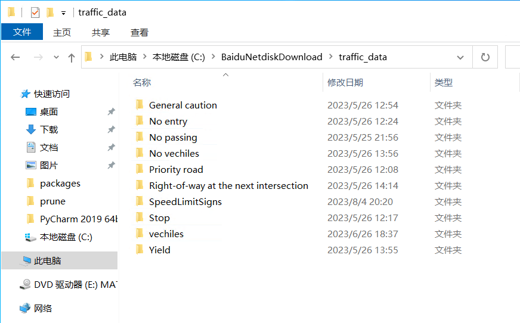
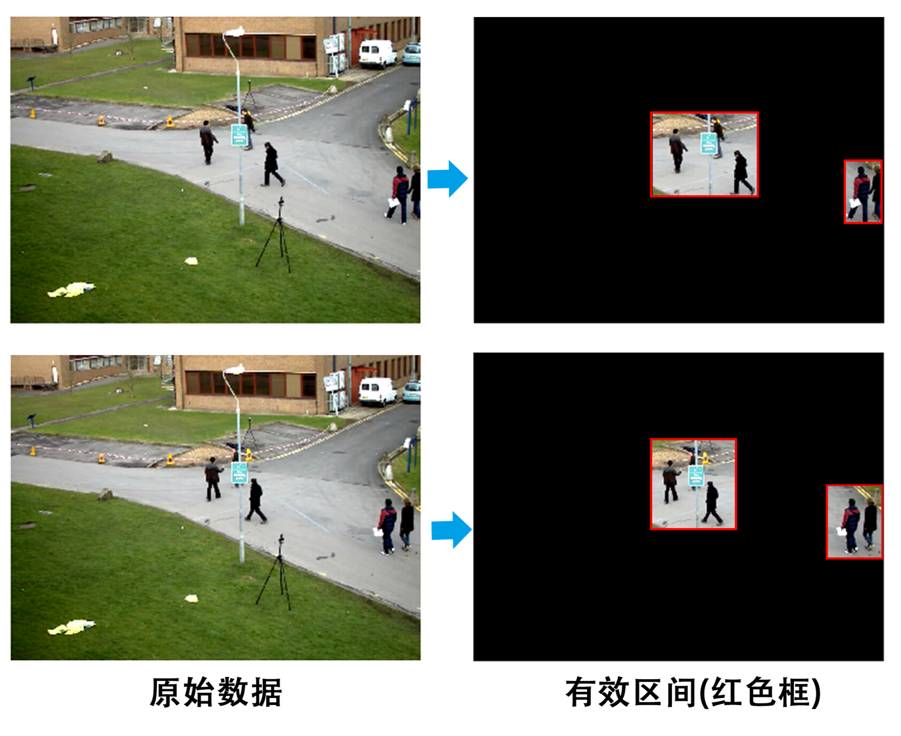
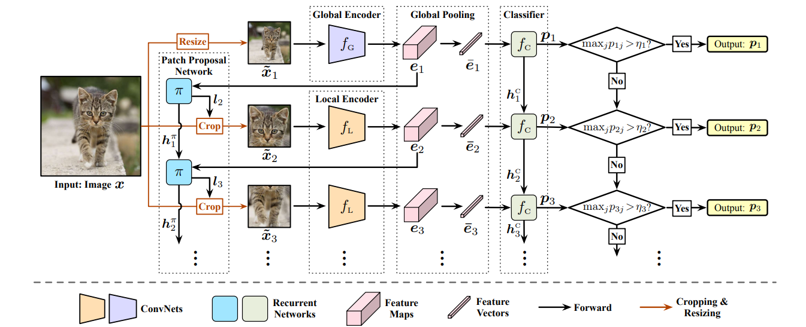

【GFNet】校园交通标志分类
===

【写在前面】
---
① 此文件夹可视为【MTL】计算机视觉+多功能监控安防的前置项目  
② 如何让目标检测足够快？试想，在同济校园中，监控摄像头的数量远超8000+，按照每秒25帧图像的帧率计算，模型需要处理的图像是海量的。此外，速度在一定范围内和成本构成反比关系，模型处理图像的速度越快，意味着需要投入的GPU购买经费更少，成本更低，这一点在实际工程中是非常重要的！  
③ 此文件夹旨在理解GFNet原理的基础上，以校园交通标志的识别为场景，进行实践  
④ 从原理来讲，GFNet还并不非常适用于目标检测，或者说In-the-wild目标检测，GFNet更多的还是图像分类，这一点从论文使用的ImageNet数据集也可以看出。GFNet更多的还是适合用在单类别、单物体，且物体所占的画面比例不能太小的图像分类任务中  
⑤ 尽管有上述限制，但是GFNet先粗略总览再定睛细看的思路，以及CNN型网络、RNN型网路、Actor-Critic强化学习这三者的结合使用是非常有潜力的  

【效果展示】  
--
  

【数据集】
---
① 实际使用了CCTSDB 数据集  
② 另外模仿ImageNet的样式自行收集了包含10个类别，单个类别300+的数据集，大概0.5G大小  
比较庆幸的是，读取数据集步骤使用了torchvision.datasets.ImageFolder，这意味着只要将数据集按照不同的类别划分为不同的子文件夹即可，无需额外标注标签  
链接：https://pan.baidu.com/s/1wkWVfyoXJQjgYmWS9UczPQ?pwd=q5mn 
提取码：q5mn   
  

数据集中的图像样例如下图所示：  

  

【原理概述】
---
实际上，在目标检测任务中，CNN在大面积比例的背景区域做了大量的冗余计算，如果能够提前准确预判ROI区域，那么无疑将大量减少在背景区域的无效计算，提升推理速度。其实提前准确预判ROI区域类似于将两阶段目标检测网络中的RPN网络前置。  
  

  

如上图所示，给定一张包含猫的图片，我们人眼是如何判断图片中有只猫的？GFNet的网络结构或许是一个十分贴切的模拟：  
① 将输入的高清图像下采样为一张缩略图，输入全局编码器提取全局特征，分类器做分类，若当前置信度超过阈值，则停止，否则刚刚提取得到的全局特征信息给到PPN网络，决策，从原图中裁剪出一块区域作为ROI区域；  
② 将ROI区域输入局部编码器提取局部特征(全局→整张图，局部→从原图中裁出来的一小块儿区域)，分类器做分类，若当前置信度超过阈值，则停止，否则刚刚提取得到的特征信息继续给到PPN网络，更新决策，从原图中裁剪出一块更合适的区域作为ROI区域，以使得分类区得到更高的置信度；  
③ 重复步骤②知道置信度超过阈值或者决策轮次超过最大轮次阈值；  
④ 全局编码器和局部编码器是CNN型网络，你可以自由选择合适的网络,如ResNet等；  
⑤ PPN网络以及分类器是RNN型网络，你可以自由选择合适的网络，如GRU等；  
⑥ PPN网络不断更新决策的思想体现了强化学习，论文中是用经典的PPO算法进行控制，对使得分类器分类置信度增长尽可能大的ROI区域裁剪决策进行奖励； 
⑦ PPO算法控制下的决策过程可以理解为：想象一个二维高斯形状的地形图，在决策过程中推动地形演变直到峰值区域到达最合适的位置，不过二维高斯是单峰的，这也就是为什么说GFNet目前只适合单类别、单个物体的图像分类，不过经过适当的优化改进，将其应用到多类别多物体的目标检测是一个很有意思的事情。  
***详细的原理解释参见《GFNet辅助理解.pdf》***  

【写在最后】
---
把测试集5%的图像加入训练集，可以提高多少准确度？  
关于效果展示图片中0.999+的准确率：  
没错，正常情况下，准确率只有0.7-0.8+的水平(本实验中训练集较少，质量并不高)，但是，将测试视频每秒25帧导出为图片，将其中5%的图像加入训练集之后重新训练，惊讶地发现置信度几乎稳在了0.99+  
***诚信原则，在比赛或者论文等事件中，永远不要利用测试集加入训练集的阴招提分哦***  
