【SLAM】三角测量&深度估计
===

【写在前面】
---
① 本项目为小白本白的视觉SLAM入门  
② 知识来源于，emmm，经典书目，《视觉SLAM十四讲 从理论到实践》  
链接：https://pan.baidu.com/s/1s_l1jkRH3vFEoY9S8ni2Sg?pwd=jc4a   
提取码：jc4a   
③ 本项目旨在利用传统的三角测量和Deltas论文中提出的算法估计 Portland_hotel 数据集中图像对应的深度，并定量对比其Abs、RMSE、RMSE log指标，其中传统三角测量方法分别使用 SURF、SIFT、ORB这3种不同的特征点检测方法并进行对比，Deltas算法是指论文《DELTAS Depth Estimation by Learning Triangulation And densification of Sparse points, ECCV2020》中的方法。  

【数据集样式】
---
① RGB图像  

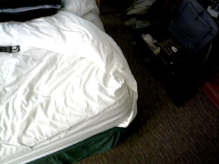  

② 深度图像  

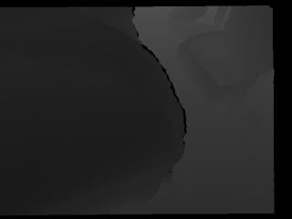   

【实验环境】
---
① 传统算法的实验环境为：  
ubuntu 20.04, opencv 3.4.15, opencv_contrib 3.4.15 cmake 3.16.3  
② Deltas算法的实验环境为：  
AutoDL- RTX3080 pytorch1.8.1+cu111 opencv-python 4.7.0.12 python3.8.10  

【Tips】
---
① 本项目中传统算法实现的实验环境为ubuntu，这是因为slambook提供的实验代码就是适合在ubuntu环境下执行的代码，但是！  
但是！配环境巨坑！如果再来一次，从运行代码辅助知识理解的角度出发，我会用python环境平替ubuntu，然后利用ChatGPT把c++源码转成python。
但是！如果实际工程项目，还是C++哦。  
② Deltas算法配环境倒是没什么坑，老样子，我当时还是在Autodl上租的机子。  
如果您配环境遇到问题，可以：  
1. 注册一个autodl账号，按需租用GPU算力 ***【非广告】***  
2. email: 1687107467@qq.com  
邮件主题：autodl-SLAM三角测量&深度估计-镜像共享  
邮件内容：您的autodl账号id

【code文件说明】
---
1.download.py用于爬虫爬取portland数据集（数据集官网没办法打包一整个数据集下载，只能点击一张图的链接下载一张，wget命令也不怎么有用）。执行download.py需要原始的网页html数据，即code文件夹中的两个html文件，浏览器上直接ctrl+s就能把这俩网页保存下来  
2.按照原论文开源代码中的ScanNet Sample数据格式样例准备相应格式的portland数据集。pose.cpp用于估计相邻两张图像的RT变换矩阵  
3.准备好数据集之后，用my_sequence_folders.py替换原来的sequence_folders.py  
4.python mytest.py即可运行，得到最终的指标结果  
5.triangulation.cpp负责执行传统三角测量算法  

【数据集处理】
---
1.Portland官网中无法一次性打包下载所有文件，此处通过python爬虫程序完成。在网页中ctrl+S快捷键下载html源文件，会发现html文件中存在着所有图片的网址链接，且前缀均为href  
  
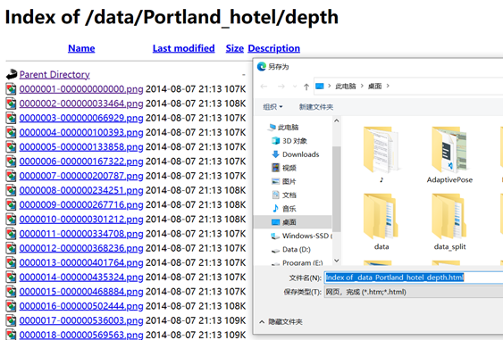  
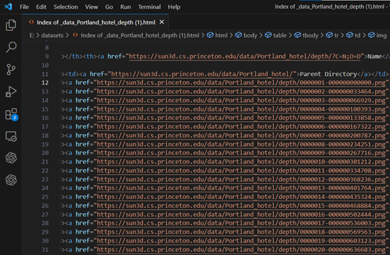   

2.通过python脚本提取每张图片得到url链接，之后利用requests库自动下载图片  

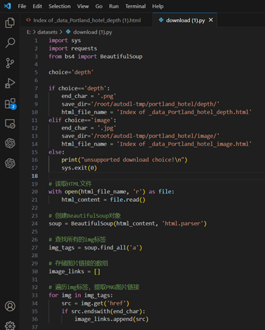    

3.下载得到的初始图片序号是中断的，depth缺失标号区间为[4756, 7437]的深度图像，image缺失标号区间为[4756, 7436]的RGB图像，  
从三角测量的原理来讲，应当把中断的两个区间划分为两个不同的场景,否则就是断点附近相邻两张图像之间出现大幅移动，甚至都已经不再是同样的画面，极端情况下无法匹配到特征点对。  

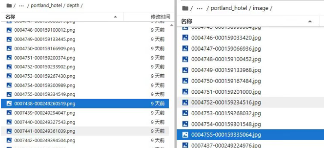  

  
此外，深度图像和RGB图像通过图片名称的前7位数字对应，图像名称中得到时间戳信息在本实验中并不发挥作用，因此，在实验中将从0000000.png开始，重新命名图像，以方便后续处理。  
4.需要注意的一点是，虽然deltas在readme中有如下说明，但并不需要将下载下来的640×480的图像resize为320×240大小，因为在deltas论文的数据预处理代码中已经有resize操作了。  

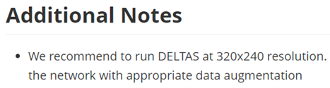  

【相机外参估计】
---
1.若想在portland数据集中测试deltas方法，需要额外生成包含相邻两张图像之间相机位姿运动的R、T矩阵数据，写入pose.txt中。官方并不直接提供这部分数据，而是提供了计算脚本，其中可以发现官方的方法为SIFT+RANSAC  

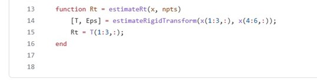
  
2.为了省略再次配置环境的麻烦，直接利用slambook对极几何章节实验中的ch7/pose_estimation_2d2d.cpp，进行相应的修改即可。这一过程中发现，portland数据集中少数相邻的两张图像检测到的匹配的特征点数少于5个，不满足“五点法”的要求，以及导致本质矩阵无法计算的问题。在程序中进行相应的判断，并将出错的图片名称记录在txt文件中，删除对应的图片即可。  
  
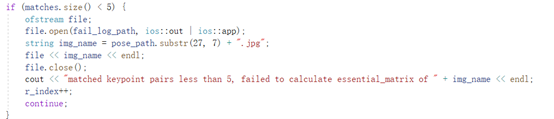  

【实验过程】
---
概括而言，实验原理为三角测量，也就是通过在两处观察同一个点的夹角，确定该点的距离。Slambook提供的第七章配套实验代码中，已经实现了大部分代码，需要自行实现的部分更多的是数据集处理以及SURF、SIFT特征点检测与匹配部分。  

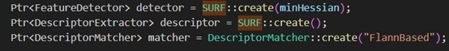  
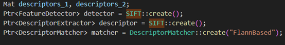  

对于扩展部分deltas而言，虽然论文作者并未开源模型的训练代码，但可以利用已经发布的预训练模型在portland数据集中进行测试，其主要逻辑为将portland数据集格式改造为开源代码提供的样例数据格式即可。样例数据格式如下：  

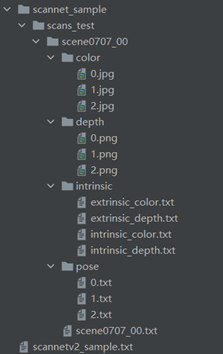  

【论文原理】
---
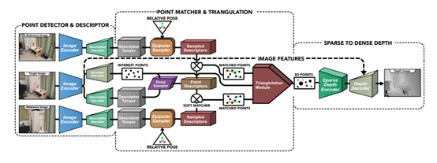   

① 利用类似于SuperPoint的网络进行目标图像的特征点提取与描述子计算，同时也为辅助图像进行描述子计算。但是SuperPoint浅层的骨干网络并不完全适合于本文的深度估计任务。因此出于权衡效率和性能的考量，作者使用了ResNet-50编码器替换了原来的骨干网络。  
② 根据相对位姿（对极几何）的关系确定目标图像特征点在辅助图像的空间范围。然后在搜索空间中采样描述子，并与目标图像特征点的描述子进行匹配。然后利用SVD奇异值分解的方法进行特征点的三角化，最后根据输出的3D点创建稀疏深度图。  
③ 稀疏深度图编码器输出的特征图与RGB图像编码器输出的特征图用于生成最后的稠密深度图。  

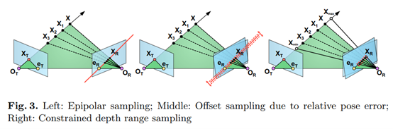   
  
一种直接的特征点匹配策略是：将目标图像特征点的描述子与辅助图像上所有可能的位置进行匹配对应。然而这种策略因为计算量过大而不能采用。考虑到匹配点的对应满足对极几何的关系，所以我们只在辅助图像的极线上进行搜索。如上图所示，在理想情况下匹配点会位于极线上。然而实际情况中由于相机位姿存在偏差等因素，我们在极限搜索时会加上一个小的偏置。考虑到极线延伸范围为-∞到+∞，我们将极线范围限制在可行的深度探测范围内（如右图所示）。对于每一幅辅助图像，目标图像特征点的描述子沿着极线方向与描述子进行卷积，可得互相关图。

【注意事项】
---
① 对于deltas而言，可以通过输出张量尺寸的方式帮助在实验过程中更好地理解算法逻辑  

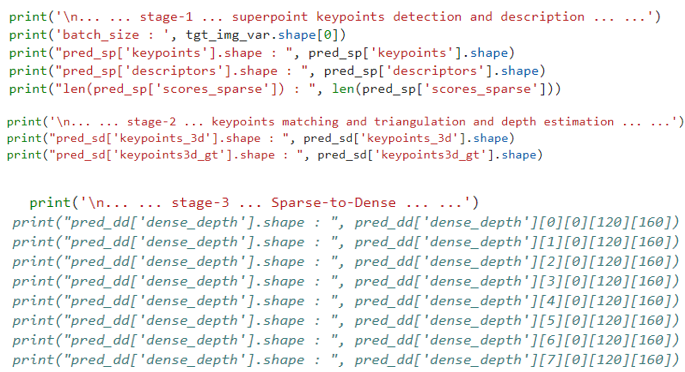    
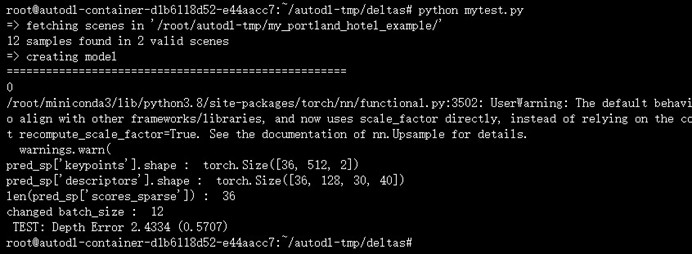   

② Portland原数据集中的深度信息不能直接使用，而应当进行3位移位操作  

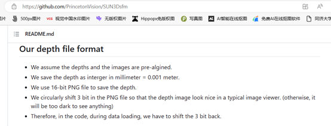   
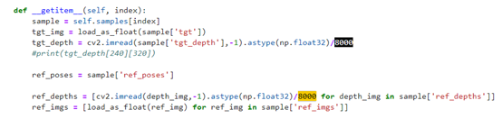   

③	过滤明显的错误数据  
Portland数据集场景为室内旅馆，通常而言，物体的深度距离应当少于2.5米，同时图像中没有出现距离相机非常近的物体。因此可以将深度图读取后以及模型预测后，大于2.5m或者低于0.5米的数据滤去，得到更科学严谨的测试结果  
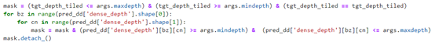   

④	特殊后缀文件隐藏  
在实验过程中发现，python执行过程中往往会生成.ipynb_checkpoints的中间文件，在一些情况下图像化界面中并不会显示这些特殊后缀的文件，但在循环遍历读取文件夹图片时，这些隐藏文件会导致程序报错，且不容易被发现错误源头  

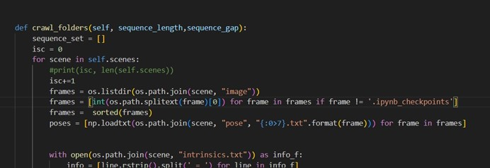   

⑤	评测指标计算公式  

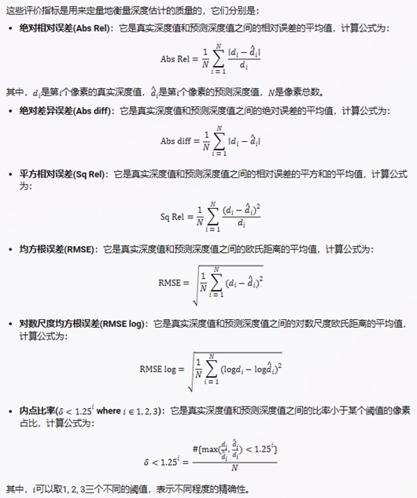   
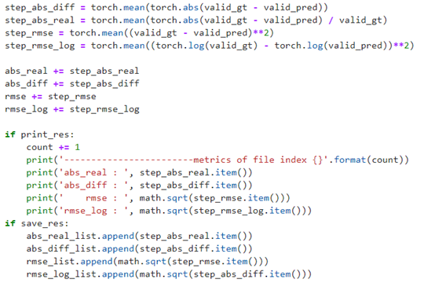   

【结果对比】
--
总体来看，DELTAS为效果最好的方法，而且这是在没有用Sun3d数据集重新训练的情况下（portland_hotel数据集是Sun3d的一个场景子集）。  

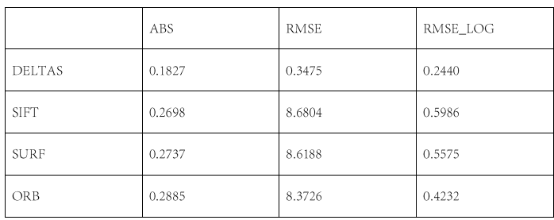  

【一个不严谨的地方】
---
本实验中所使用的光心、焦距数据可能并不准确。在实验过程中并未查到portland数据集对应的相机光心和焦距数据，因此，直接采用了必应AI给出得到结果。不过从实验结果以及和其他同学的交流结果来看，所用光心、焦距数据应该是正确的。  

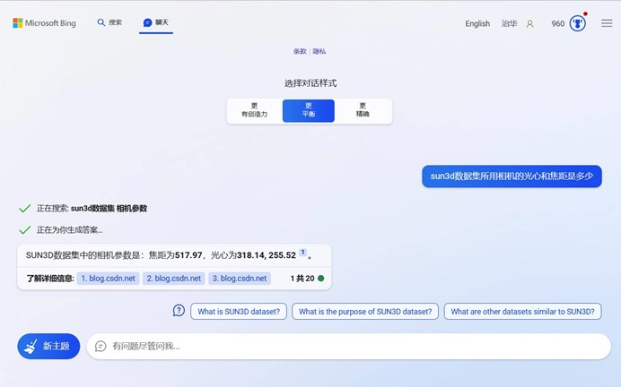  
