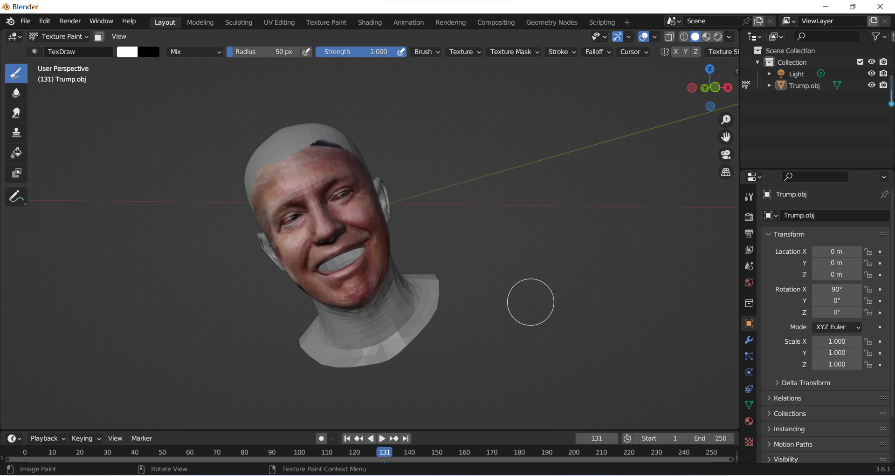
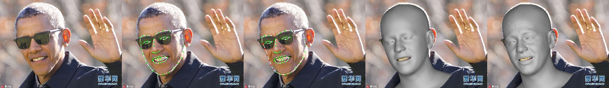
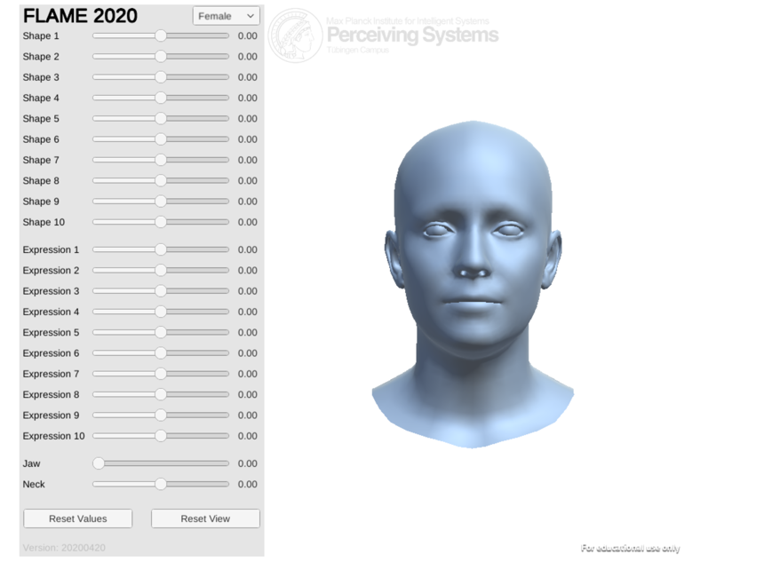
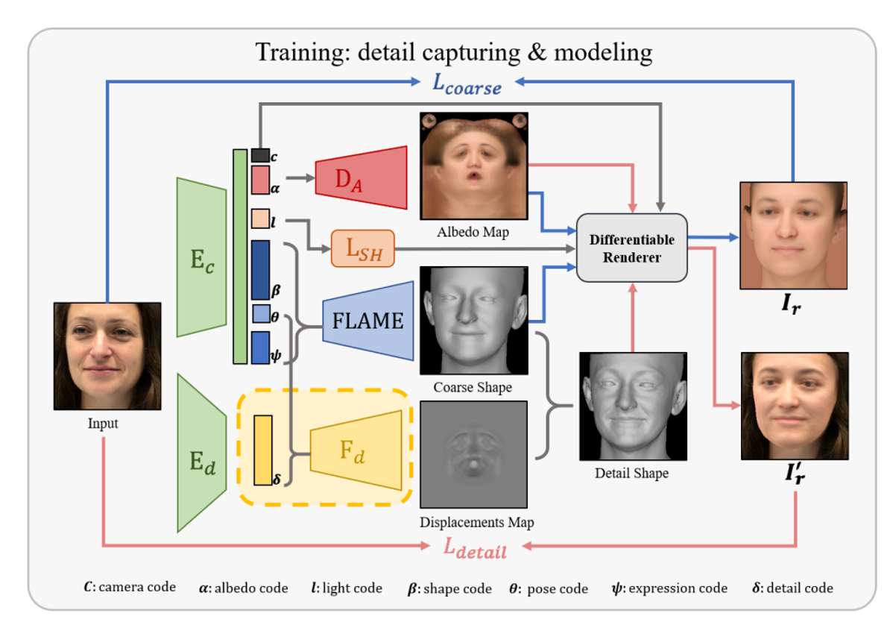
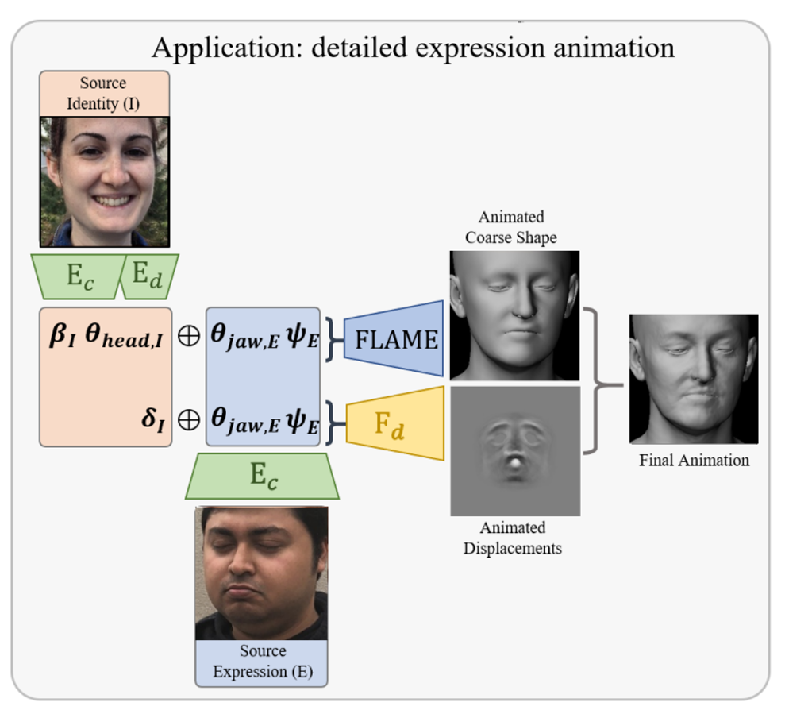

【三维人脸重建&表情迁移】DECA
===

【写在前面】
---
① 这篇论文应该是大学三年读过的最难懂的一篇论文，和小伙伴相互争论了2天才总算是搞清楚，哈哈~  
② 建议在理解DECA之前先看【人脸对齐】3FabRec这个项目以深刻理解自编码器  
③ 虽然这套算法对于墨镜遮挡等条件的处理能力还不够，  
虽然迁移的表情看上去细节似乎还是不太够，  
虽然这篇论文似乎是揉了人脸对齐、FLAME等很多东西的“火锅”，  
虽然对于比较奇形怪状的人脸处理能力还不太够(有时候发现重建出来的三维模型自带瘦脸功能，对于普通的正常人脸，有时候五官比例有点不协调，看起来隐隐觉得怪怪的，一部分原因可能是训练数据集还不够丰富)  
但是论文作者解耦特征信息的思路以及整个项目的网络“架构”很令人佩服！  
④ win环境下编译安装pytorch3d巨坑，下面的链接是本人python3.8环境下编译过的pytorch3d-0.6.0版本，当您遇到一些玄学问题时，也许可能大概说不定会有所帮助，但配环境这个事情本身就很玄学，不过可以确定的一点是，不要把['ninja', '-v']改成['ninja', '--version']，否则你会变得不幸(当你身处搜索博客&配环境的进程中时，你会明白这句话是什么意思的)。  
链接：https://pan.baidu.com/s/1S58uEo8aT9kG-IF_er0ECw?pwd=ccj5 
提取码：ccj5 

【效果展示】
---
① 输入一张川建国同志的照片，输出重建的三维人脸模型  

  

② 输入一张奥巴马的照片，从二维照片到三维模型  

  

③ 输入各种不同表情的其他人脸和川建国同志的脸，把其他人的表情迁移到川建国同志的3D脸上  
  
  
***【Tip】第一列3张川建国的照片差异还是蛮大的，但是第三列的3个重建出来的人脸模型相似度非常高，体现了模型的鲁棒性***  

【原理分析】
===
【自编码器】
---
请参考【人脸对齐】3FabRec这个项目的原理讲解PPT  

【FLAME模型】
---
  

***首先，flame模型是一个统计学模型***  
① flame模型可以从4D扫描数据中学习一个模型的面部形状和表情，这四个维度分别是Shape、Expression、Pose和Color
② 也就是说在我们获取到一个特定的三维人脸扫描序列之后，可以利用flame模型进行拟合，从而得到一个具有个性特征的人脸模型。之后，我们就可以通过改变表情、动作等参数，从而使模型获得新的表情  
③ flame模型的输入是三维人脸的扫描序列而不是二维图像，输出的是一个可以调节表情、姿态、形状参数的三维模型，DECA所做的很大一部分事情其实就是搭建从二维图像到flame模型所需的三维人脸扫描数据的桥梁  

【网络架构】
---
   

① 上图图展示了DECA模型面部细节捕捉和模型建立的训练流程：  
首先输入一张二维的图像，通过编码器将人脸的特征提取出来，其中𝐸𝑐在粗特征损失函数的控制下可以提取出建立人脸粗模型的参数𝛽(人脸形状相关的特征)、𝜃(人脸姿势相关的特征,其中又包含了𝜃_ℎ𝑒𝑎𝑑和𝜃_𝑗𝑎𝑤)和𝜓(表情有关的特征)，以及其他和光照、纹理、相机有关(如镜头焦距、视角等内外参信息)的特征  
② 𝐸d在细节特征损失函数的控制下可以提取出和人脸细节有关但是和表情无关的特征𝛿  
③ 将𝛽、𝜃和𝜓输入到FLAME模型中就可以得到一个粗糙的人脸模型，这也是所要建立的最终三维模型的雏形  
④ 之后，将𝜃、𝜓和𝛿利用𝐹𝑑解码器进行解码，生成和面部细节有关的位移贴图，将其覆盖在粗模型表面就可以得到对应的细节人脸三维模型  
⑤ 具体而言，①中已经有相机信息，在得到三维人脸模型之后，用同样的相机给三维模型拍张照  
⑥ 之后使用渲染器对其进行重新渲染，生成合成的面部二维图像𝐼𝑟′，通过最小化𝐼和𝐼𝑟′的差别就可以不断优化人脸细节特征。同理，将不包含细节的三维模型进行渲染生成𝐼𝑟，用同样的方法也可以优化人脸粗特征。经训练后的模型就可以很好的适应不同的原生输入图片，得到不错的三维重建效果。同时，由于在特征提取的时候将𝜓(与表情有关的特征)和其他面部细节进行了分离，所以这也使得表情迁移的功能可以实现  
⑦ 具体而言，损失函数是通过人脸关键点的差异、上下眼皮关键点之间的差异等项进行量化的  

   

⑧ 上图展示了表情迁移的具体实现流程，我们如果想将图片E中人脸的表情迁移到图片I上，那么我们就需要将E中与表情有关的特征进行提取并将I中的相应部分进行替换。无论是在粗模型建立还是在细节位移贴图的生成中，都使用了图片E和表情有关的特征，最终我们便可得到具有图片E中表情的I的三维模型~  

