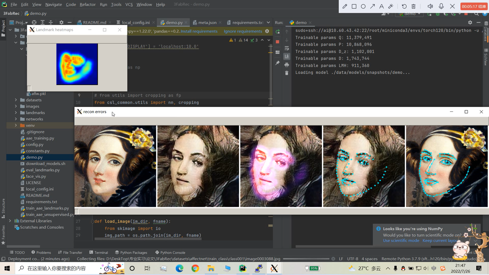

【人脸对齐】3FabRec
===
【写在前面】
---
① 22summer，大二暑期专业实习，小白本白读论文做实验的起点，相当于老师带着体验了一遍学硕读论文&做实验的日常  
② 3FabRec是本人正儿八经读的第一篇顶会论文，自编码器也是本人专业名称套专业名词不断套娃查询终于搞清楚的记忆最深刻的专业名词  
③ 这也是第一次使用远程服务器跑代码做实验  
④ 这个文件夹偏向于论文原理解读+远程服务器使用指南  
⑤ 3FabRec原始代码没有处理In-the-wild人脸图像的能力，只能处理单张图像、单张人脸且人脸处于图像中心的情况，  
  这里给出了dlib-test.py,实现先借助dlib库定位裁剪出人脸，然后再送给3FabRec处理的功能  
  3FabRec速度倒是还行，但关键点的识别效果明显差于3DDFA，《Towards Fast, Accurate and Stable 3D Dense Face Alignment，2020ECCV》

【论文效果】
---
  

【论文原理】
---
请直接查看《论文原理详解.pptx》

【远程炼丹服务器使用指南】
---
① 基操请直接看《远程服务器连接使用说明.docx》  
② 大多情况下远程服务器本身并不支持图形界面的显示，比如代码中如果执行cv2.imshow就会报错，无法正常弹窗到本机显示图像，  此时可以将所有的imshow改为imwrite；或者按照视频(demo-py执行过程.mp4)操作，请注意，软件的操作顺序不可颠倒，请严格按照视频中的操作顺序来。 
操作视频：
链接：https://pan.baidu.com/s/1JvwT7xuMgeGhMcn0G59zpg?pwd=k3ii 
提取码：k3ii 
