【手势&声控】懒人PDF阅读器
===

【写在前面】
---
① 2023spring，同济大学软件学院专业基础必修课《用户交互技术》期末项目  
② 写这个项目的初衷是希望能葛优躺在沙发上用手势和语音控制电脑上的PDF阅读器，懒得操作鼠标  
③ 合作者：Zhihua Liu, Chen Chen, Xunyuan Zhu(我们仨里最帅的那个，我觉得)  

【功能总览】
---
① 手势控制，mediapipe实现：鼠标移动、调节屏幕显示亮度、上下翻页、滚动页面、放大/缩小页面、开启语音控制、关闭手势控制  
② 语音控制，调研科大讯飞语音API实现：语音转笔记文字、上下翻页、页数跳转、询问时间  
③ 其他功能，OCR+调用百度翻译API实现：高亮显示并存为笔记、划词翻译  

【手势总览】
---
一共只有4种基础手势，即可实现7种功能~  

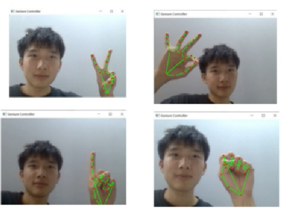  

【功能展示】
---
1.【手势控制】移动鼠标，比耶的手势，鼠标会随着手的位置移动  
  
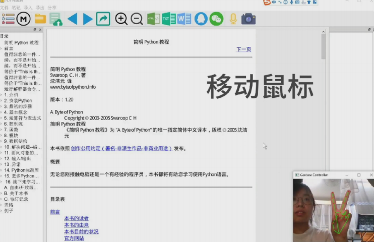  

2.【手势控制】调节屏幕亮度，左手拿捏的手势，(win系统)屏幕亮度会随着左手的左右滑动而变暗/变亮  
  
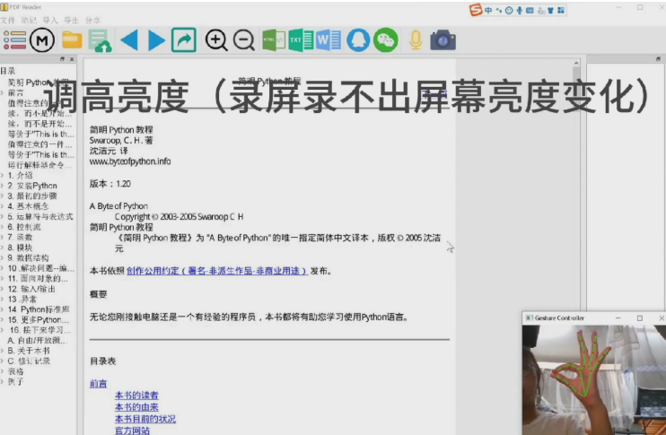  

3.【手势控制】上下翻页，左手拿捏的手势，PDF阅读器会随着左手的上下移动而上下翻页  
  
  

4.【手势控制】缩放页面，右手拿捏的手势，PDF阅读器展示的页面大小会随着右手的左右滑动而缩小/放大  
  
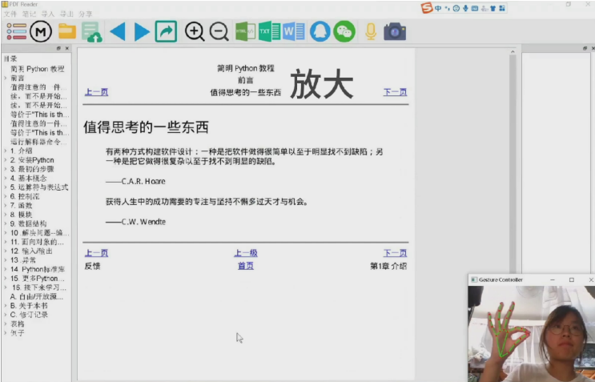  

5.【手势控制】滚动页面，右手拿捏的手势，有时候一页太大，屏幕无法完全展示，所以某页PDF会出现滚动条，会随着右手的上下移动而上下滚动展示内容    
  
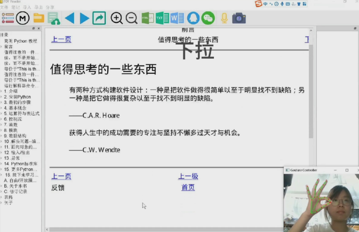  

6.【手势控制】开启语音控制，左手比耶的手势收起中指的动作，PDF阅读器会开启语音控制，当监测到用户说话终止后，语音控制会自动关闭    
  
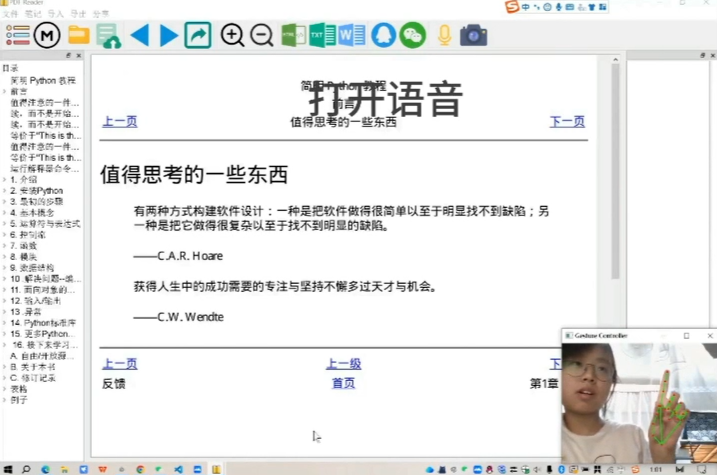  

7.【手势控制】关闭手势控制，左手握拳的动作，PDF阅读器会终止手势控制      
  
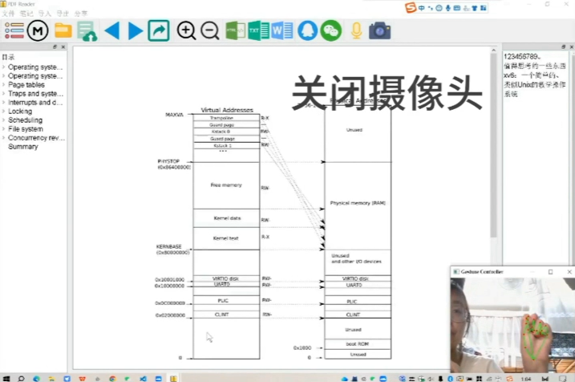  

8.【语音控制】语音转笔记文字，语音指令关键词“笔记”，用户说的话会被自动转为文字笔记并记录在PDF阅读器右侧的笔记区域      
  
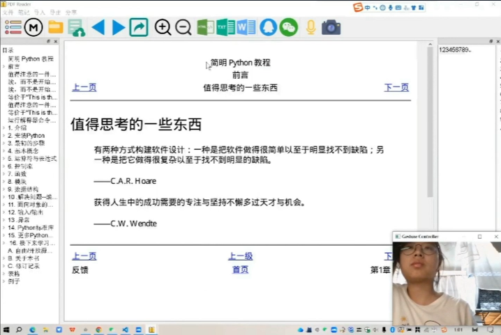  

9.【语音控制】语音翻页&页数跳转，语音指令“上一页”、“下一页”、“跳转到XX页”      
  
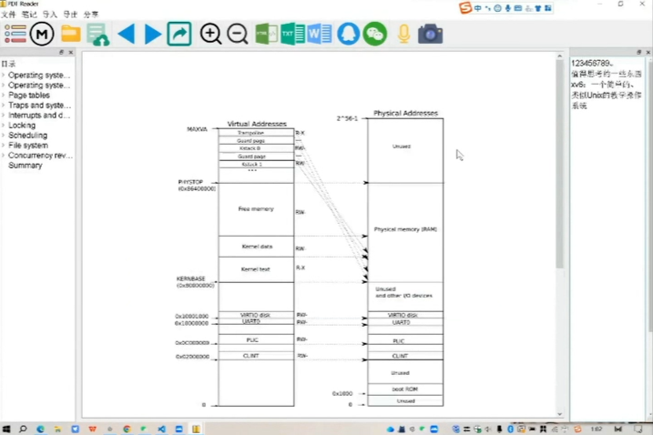  

10.【语音控制】时间询问，语音指令关键词“几点”，PDF阅读器会弹窗显示当前时间        
  
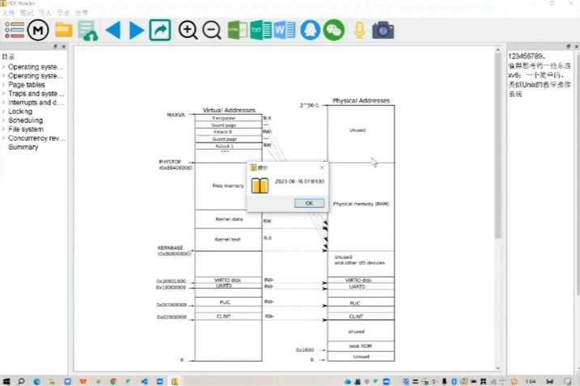  

11.【OCR+语音】高亮显示，语音指令关键词“笔记”，高亮显示的内容会被自动转为文字笔记并记录在PDF阅读器右侧的笔记区域   
  
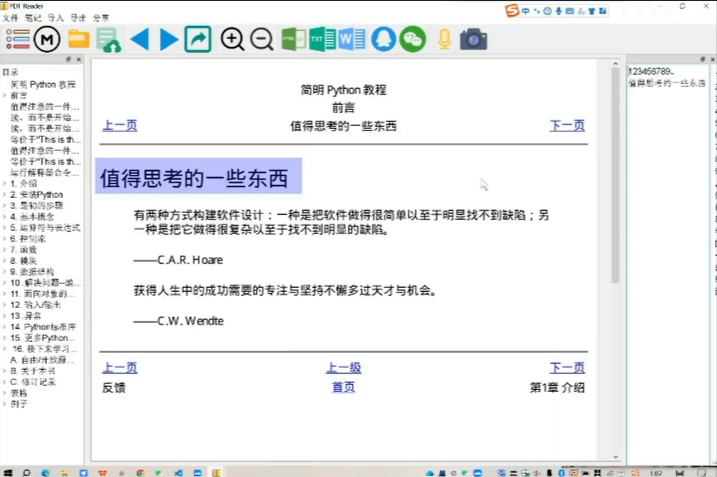  

12.【OCR+语音】划词翻译，语音指令关键词“翻译”，高亮显示的英文内容会被自动翻译为中文并显示在PDF阅读器右侧的笔记区域   
  
  

【代码结构】
---
关于代码结构的简介，请参见《说明文档.pdf》的最后一部分  
