【统计分析与建模&快速路交通事故预测】
===

【写在前面】
---
① 2022fall，同济大学软件学院专业选修课《统计分析与建模》期末项目   
② 合作者：Zhihua Liu, Chen Chen, Jiayi Yang, Yunguang Ning   

【问题简介】
---
交通运行状态和事故风险之间存在着关联性。有学者认为，短期内交通流的变化会对事故的发生产生重大影响。因此，利用事故数据和相应的交通流检测器数据建立一个合适的模型，可以预测快速路的事故风险，及时识别可能发生事故的交通状况。在此，识别事故是否发生的交通状况的问题可以通过对可能发生事故和不会发生事故状态的分类来简化，分类模型的输入数据为事故前或正常的道路交通状态，输出为是否存在事故风险，从而预测事故是否可能发生。  
我们根据同一天内不同路段在不同时间段内的流量、速度数据和事故发生的开始时间、结束时间数据，将数据进行预处理，通过可视化、相关性分析等方式人工增加了若干特征，并通过建立不同的统计模型，给出预测快速路事故风险的有效方法，最终取得了较好的评估结果。  

【文献调研】
---
2.1主要参考文献  
	① 孙剑, 孙杰. 城市快速路实时交通流运行安全主动风险评估[J]. 同济大学学报(自然科学版), 2014, 42(06): 873-879  
这篇论文基于上海高速公路系统采集的线圈检测器数据和事故数据，应用贝叶斯网络（BN）模型对高速公路的实时交通流参数和事故风险进行建模分析，并采用高斯混合模型和最大期望算法对BN模型的输入和参数进行估计。采用高斯混合模型和最大期望算法对BN模型的输入和参数进行估计，分别对缺失数据进行有效处理，从而主动评估高速公路实时交通流的运行安全风险，对事故进行预警。结果表明，利用事故发生前5-10分钟内事故发生地上下游各一个检测器的交通流数据建立的BN模型效果最佳，事故预测准确率为76.94%。最后，不仅将BN模型与经典的事故风险估计算法如朴素贝叶斯分类法、K-近邻法、反向传播（BP）神经网络等进行了比较分析，还与现有的实时风险评估结果进行了比较分析，结果表明BN模型具有最佳的预测效果。  
	② 杨奎,余荣杰,王雪松.基于车道集计交通流数据的事故风险评估分析[J].同济大学学报(自然科学版),2016,44(10):1567-1572.  
这篇论文以上海市城市快速路为研究对象,基于病例对照研究方法提取事故与非事故条件下的交通流数据,并将样本随机拆分为训练数据与测试数据。采用病例对照设计提取交通流数据,病例与对照的比例采用了较常用的1∶4比例。对照组数据的选取考虑了5个条件:①对照组日期与对应事故所在的日期不同;②与事故发生时间相同;③与事故发生地点相同;④对照组与事故发生对应一周中的同一天;⑤对照组对应事故时间前后各1h内同地点无交通事故发生。以7∶3的比例在事故与非事故层面(病例对照组层面)将最终样本随机拆分为训练数据与测试数据,前者用于事故风险评估建模,后者用于模型的预测精度检验。与既有研究的事故风险评估模型预测精度进行对比,验证了基于5 min车道集计交通流数据具有构建事故风险评估模型的可行性,可进一步改进算法(如考虑事故类型的差异性、空间相关性等)、建模技术(如支持向量机等智能算法)、数据处理方法等获得更高精度的模型。  
	③ 张发财. 基于卡尔曼滤波的城市快速路交通流预测及事故检测研究[D].北京交通大学,2012.  
      这篇论文作为一篇硕士毕业论文，一方面对现有的快速路交通流分析方法进行了系统的概述，帮助我们建立了分析建模快速路交通流的整体认知：快速路交通流是随时间、空间两个维度的变化而变化的非线性、时变的数据流，可贵的是文中对于一些细节特征进行了介绍，如：交通流特征性的三项基本要素：速度、交通流量、交通流密度（占有率），不同的观测尺度（采样周期），意味着不同程度的不确定性，前人的实验证明观测尺度越短往往意味着越大的不确定性，交通流只有在2分钟的观测尺度之上才会呈现出分形现象，当把观测尺度降到2分钟以内时，预测将往往得不到理想的结果，这些细节的介绍对于我们进行实际的数据处理提供了指导思想；另一方面，文中利用卡尔曼滤波进行快速路交通流预测以及进行事故检测的方法让我们意识到了卡尔曼滤波在处理这一问题上的潜力，启发了我们将卡尔曼滤波应用于此次建模分析项目，并得到了很好的结果。  

【数据分析与预处理】  
---
原始的数据仅仅包含segment、time、flow、speed四列信息，直接凭借如此有限的信息并不能帮助统计模型，尤其是逻辑回归模型实现很好的分类效果。因此，总体而言，此次实验中，数据的分析与预处理的过程是一个做“加法”的过程，目的是为了扩展出尽可能多的“特征列”以供择优入模，而此后的建模分析过程是一个做“减法”的过程，从备选特征中选择效果最好的入模并尽可能利用最少的特征信息达到最好得到效果。  

【数据分析】
---
观察数据，原始数据集包括crash_data.csv和traffic_data.csv共两个文件。其中，crash_data.csv的每一行代表一次事故，包括快速路的路段id（segment）、事故起始时间（starttime）和事故终止时间（endtime）；traffic_data.csv的每一行代表某一路段（segment）在一天中的某一时刻（time）的流量（flow）和车速（speed）信息，每条记录间的时间间隔通常为2分钟。对于每个segment，其前两位表示了快速路id，后三位表示该快速路上的具体路段。  
首先，考虑将两份数据的信息合并在一个csv中，方便后面作为一个dataframe进行各种处理。为traffic_data添加is_crash列，标记该时间地点的事故发生情况：0为正常，1为事故；将time中的时间表示全部转化为秒数。  
然后，为了对数据整体有一个直观的了解，尤其是事故出现时的数据分布和变化情况，对补充is_crash和其他特征后的traffic_data绘制若干折线图，并标记事故发生时间点。绘制了折线图，具体为：  
每个segment的flow/speed变化情况，事故发生点的flow/speed用散点标出  
此处选取部分折线图进行展示：  
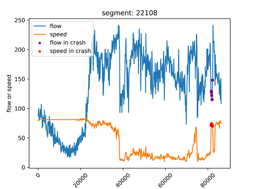  

如上，主要绘制了三种折线图，分别存储于子文件夹picture中。  

【异常值处理】  
---
在对数据进行特征筛选和建模之前，需要先检查缺失值和异常值。分析数据知，在部分segment（如23112等）中，出现了一段时间内speed不为0，而flow为0的情况，显然不符合实际。考虑到这里的flow值可能是缺失补0，因此我们删除了这些speed不为0且flow为0的行。  

【特征筛选】
---
特征筛选的判断准则有四个：  
       ① 如何包含空间信息  
       ② 如何包含时间信息  
       ③ 选择合适的观测尺度  
       因此，我们考虑扩展出如下的特征列以供入模选择：  
       ① 为了囊括空间信息，计算特定时间观测尺度下当前路段和上下游路段的流量方差、速度方差；  
       ② 为了囊括时间信息，计算特定时间观测尺度下当前路段自身的流量差值、速度差值、流量方差、速度方差  
       ③ 需要考察不同的时间尺度，时间尺度分为前2分钟、前4分钟、前8分钟和前10分钟  
       除此之外，我们将原始的时序数据进行卡尔曼滤波后分别得到新的kalman_flow和kalman_speed，并分别求和原始数据的差值，得到diff_kalman_flow和diff_kalman_speed，这么做的原因会在建模部分进行阐释；
       比较意外的一点是，在文献检索过程中我们发现，以主要参考文献[3]为代表的许多论文都是在以占有率为直接研究对象，那么为什么不以流量或速度为直接研究对象呢？在理论上我们暂未得到百分百确定的解释，但这并不妨碍我们在实验中进行尝试，因此，我们额外关注的一个特征列便是通过flow/speed得到的占有率p，事实上，占有率p确实在我们的模型中发挥了十分重要的作用，这一点将会在卡尔曼滤波中体现。  
       
【模型建立】
---
【4.1时序分析】  
【4.1.1分析思路】  
       快速路交通流本质上是随时间、空间两个维度的变化而变化的非线性、时变的数据流，因此，即使时序分析并不能像逻辑回归那样直接得到事故、非事故的分类结果，但分类的基础是“特征”，因此，通过时序分析认知数据的特征是十分必要的。
       事实上，我们最初始的思路仅仅只是将卡尔曼滤波作为和arima进行简单的对比并评价其优劣，但是在分析二者的建模结果时，我们受到了启发，并将卡尔曼滤波应用于事故分类。  
       
【4.1.2分析过程(R语言)】  
以segment编号为21101的路段的流量序列的原始数据为例，利用查看其时序图、ACF图像以及PACF图像  
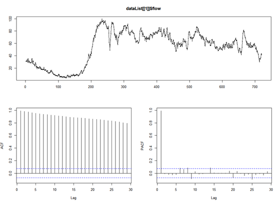  
  
③ adf.test的结果表明，p=0.8135，远大于0.05，这样的序列并不是平稳序列  
④ diff(dataList[[1]]$flow,1)进行一阶差分之后再进行adf检验，此时p值已小于0.01  
⑤ 利用auto.arima确定最优的拟合参数为ARIMA(0,1,0)，此时AIC值为3774.19  
⑥ 利用arima函数进行拟合，利用tsdiag查看发现，虽然此时，二者残差标准差基本都在[-2,2]之间，残差的自回归都为0，但Ljung-Box检验的p值表明：当延迟数超过4时，p值明显下降，出现“拖尾”，事实上，这可以表明入模逻辑回归的特征量时，时间尺度不应该超过8分钟  
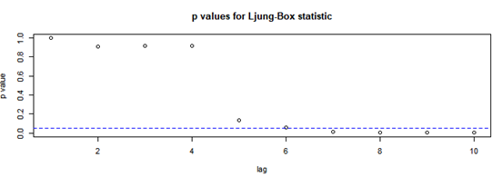  
  
⑦ 利用R语言FKF库中的fkf函数实现卡尔曼滤波，简单可视化对比arima拟合效果：  
红色为原始数据，绿色为计算出来的原始数据拟合值，绿色被红色覆盖越多，表明拟合越相似
arima拟合flow效果:  
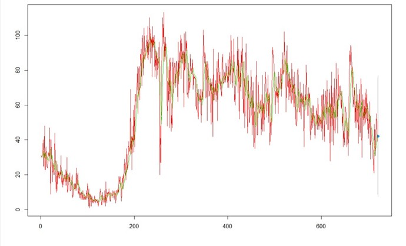  

kalman拟合flow效果：  
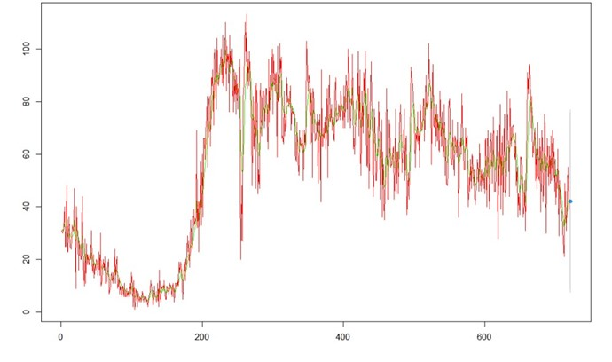  

arima拟合speed效果：  
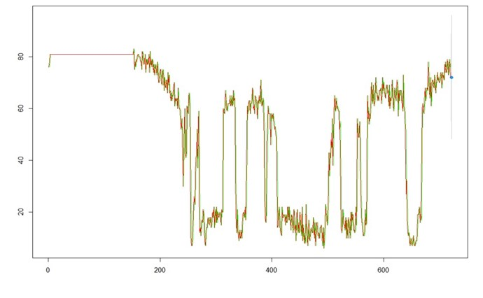   

kalman拟合speed效果：  
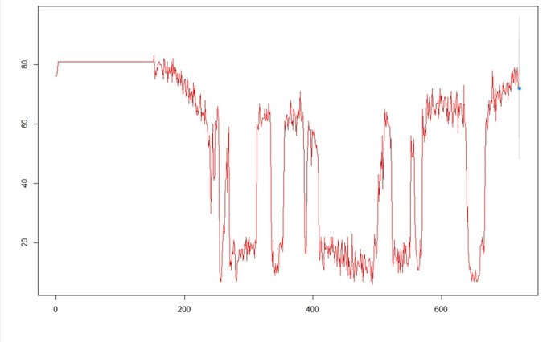   

kalman预测速度结果：  
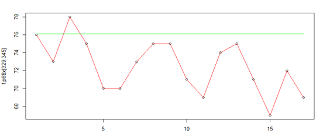  

【4.1.3分析结果】  
      简单对比kalma和arima的拟合结果可见：kalman的拟合值与原始数据几乎完全重合(当然，这里的重合效果只是图像体现较为明显，实际依旧存在着一定的差值)，得到了比arima更好的结果，但是，纵使拟合效果和真实值如此接近，则进行预测时，无论是kalman和arima都经常出现上图所示的失效现象。  
       理想情况下，时序分析应当抽取时序序列的有效特征而剩下白噪声，换言之，无论是kalman还是arima都可以实现时序序列有效特征和噪声的分离。当模型抽取了足够有效的特征时，无疑能够对将来的情况进行很好的预测。而如今kalman和arima预测失效引发了我们的如下猜想：  
       既然kalman和arima预测失效，那么说明他们并没有提取到足够有效的信息，那么这部分“有效信息”应当还留存在余下的“噪声”之中，那么“噪声”中的“有效信息”是什么？“事故”无疑是一种很强烈的噪声，那么是否存在一种可能：噪声中的“有效信息”便是“事故”，甚至可以作出猜想：当即将要发生事故或者事故发生时，“噪声”将超过某一阈值或者达到极值。  
        因此，在这样的猜想之下，我们尝试进行基于卡尔曼滤波的事故分类以及预测。  
【4.2基于卡尔曼滤波的事故分类、预测】  
       需要特别说明的是，基于卡尔曼滤波的事故分类、预测建模过程相比于下文中的逻辑回归、贝叶斯等模型的建模过程并不很完整、科学、严谨，在本实验中，只是在偶然情况下基于时序分析的结果产生了猜想并进行了粗糙简单的验证，仍需要进一步的验证和解释。   
       
【4.2.1建模思路】  
       既然要获取“噪声”信息，故而将卡尔曼滤波器的拟合值和真实数据作差，得到diff_kalman_flow和diff_kalman_speed，之后设法找到区分事故和非事故的“阈值”    
       
【4.2.2建模过程】  
① 分别将原始的流量、速度序列进行卡尔曼滤波，得到kalman_flow和kalman_speed，分别作差得到diff_kalman_flow和diff_kalman_speed，直观可见，diff_kalman_flow的数量级比diff_kalman_speed大，因此，以diff_kalman_flow为主要研究对象；  
② 初步观察is_crash为1，即发生事故的时间段的diff_kalman_flow值，其实此时已经能明显观察到，事故时间段的diff_kalman_flow明显存在小于-20的值聚集，而非事故区段很少存在小于-20的值  
③ 为了进一步放大事故区段和非事故区段的diff_kalman_flow值的差异，同时考虑到“占有率”这一指标能同时囊括flow和speed两类信息，且占有率越大时，发送事故的概率越大，因此“占有率”符合作为diff_kalman_flow“放大系数”的条件，因此，构建出基于卡尔曼滤波的事故分类、预测统计模型的最终形式：  
     1）设置阈值=-45  
     2）比较diff_kalman_flow×flow÷speed和阈值的大小  
     3）设置 is_crash[n]，其中，n=交通事故数据序列的长度，若 i 时刻处在某一事故的starttime和endtime之间，则is_crash[i]=1，否则is_crash[i]=0  
     4）设置predict[n]，若 i 时刻diff_kalman_flow×flow÷speed<-45，则predict[i]=0，否则认为当前时刻以及将来的4分钟之内将要发生事故，令predict[i]=1,predict[i+1]=1,predict[i+2]=1,predict[i+3]=1,predict[i+4]=1  
     5)  对比is_crash[i]和predict[i]，能够得到混淆矩阵，并计算accucaay、precision、recall、f1_measure  
     
【4.2.3建模结果】  
输出模型评价指标如下：
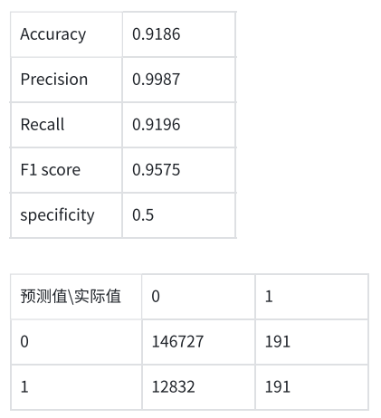  

这样的建模方法既具备事后“分类”的能力，也具备事前“预测”的能力，因为判定为事故的逻辑是一旦超过阈值则认为当前时刻和接下来8分钟的时段为事故区间段。   
       
【4.3条件逻辑回归】  
【4.3.1建模思路】   
事故风险评估模型中,事故发生与否作为二分类因变量,比较常用的分析方法有病例对照Logistic回归。常采用病例对照研究方法提取交通流数据,其中“病例”为单起交通事故,“对照”为没有发生交通事故时对应路段的“非事故”。训练数据用于构建事故风险评估模型,测试数据则用于检验模型的预测精度。  
依据文献研究，我们采用1:4的病例与对照比例，按照7:3的比例将样本随机拆分为训练数据和测试数据。  
采样方法：  
	事故组  is_crash=1的每一条  
	对照组1 同一路段+不同时间+无事故+随机选一条  
	对照组2 对应同一时间的前一路段   
	对照组3 对应同一时间的后一路段   
	对照组4 同一条路+不同路段+前后24min无事故+随机选一条  
 
【4.3.2建模过程】
设第i个配比组内包含1个事故和m个非事故,在此条件下第一个观察对象j=0为事故,其余(j=1,2,3,…,m)为非事故的概率为：  
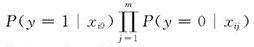  
因此任何一个观测对象(j=0,1,2,…,m)为事故,其余(j′=0,1,2,3,…,m,j′≠j)为非事故的概率之和为  
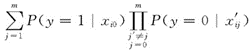   
根据Logistic回归模型式(2),可构造出y=1(即事故)的条件概率为  
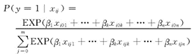   
根据概率的乘法原理,多个独立事件同时发生的概率为各事件独立发生概率的乘积.因此可以构造出所有匹配组第一个观测对象为事故,其余为非事故的概率,即条件似然函数如下（其中，x_ijk-x_i0k为事故与非事故在同一危险因素上的暴露水平之差）  
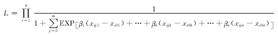   
在实际运用过程中，可以使用R语言中的‘Survival’包中的clogit()函数，及Epi包中的clogistic()函数实现。先在训练集上构建模型，再在测试集上验证模型，完成后计算并输出模型的评价指标，包括模型AUC值、准确率（Acurracy）、精确率（precision）、召回率（recall）和F1值，并绘制混淆矩阵和ROC曲线图。  

【4.3.3建模结果】
  
绘制的ROC曲线如下：  
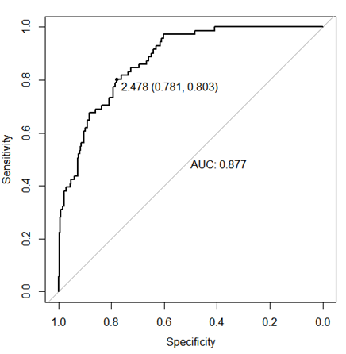   

【4.4非条件逻辑回归】  
【4.4.1建模思路】  
在上文条件逻辑回归的基础上尝试改进模型，考虑使用方法相近的非条件逻辑回归，即假设所有数据为独立分组的方式，来拟合数据。仍然沿用1:4对照采样的数据集进行训练和测试，其中训练：测试=7:3.  
【4.4.2建模过程】  
逻辑回归算法分类步骤：   
1.对输入的样本计算预测的输出，形如Z=K^T X+b，其中Z,K 和 X 均为矩阵，X为flow、speed等特征值，K为预测出的权值  
2.对输出 Z 中的每个 𝑧 计算 sigmoid 函数，将输出结果映射到 0/1，其中 sigmoid 函数定义为:  
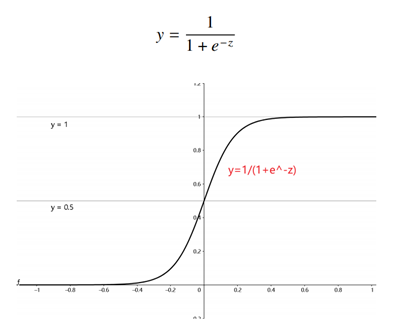   
3.计算损失函数  
单个训练样本的损失函数为：  
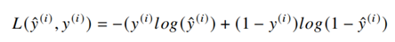  
则总体的损失函数J可以定义为：  
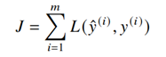   
其中m为输入的训练样本个数。
4.用梯度下降优化损失函数值，以更新回归的权重参数  
5.循环执行以上步骤，损失收敛时结束训练  
在实际操作中，可以使用python的sklearn.linear_model.LogisticRegression或R的glm来实现逻辑回归，其中glm方法得到的模型还可通过step进行逐步回归，筛选出相关性最高的若干特征。  
【4.4.3建模结果】  
在glm上针对训练集得到的模型summary如下：  
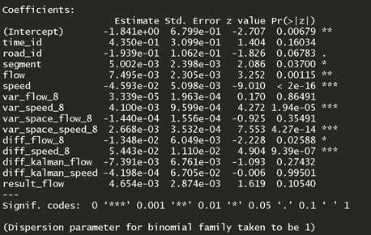   
训练集上最终predict的数值分布如下：  
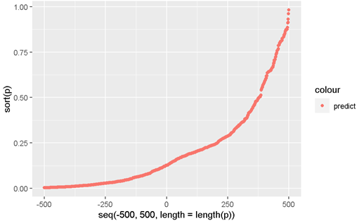   
数据的分布并不呈现标准的S型曲线，这可能是因为数据中事故：对照的1:4采样导致了不同label数量的不平衡，且模型本身存在的偏差也使得predict的分布整体偏向对照组。  
逐步回归筛选后：  
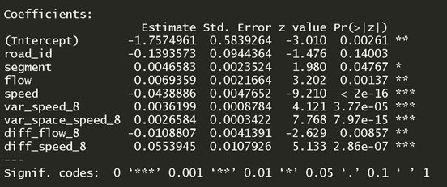    
可以看到road_id/segment/flow/speed/var_speed_8/var_space_speed_8/diff_flow_8/diff_speed_8这8个特征的p值都在1以下，对事故预测的影响相对比较显著。  
在测试集上进行预测，输出模型评价指标如下：  
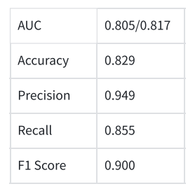   
AUC的两个值分别对应不使用逐步回归和使用逐步回归。  
使用逐步回归和不使用逐步回归得到的混淆矩阵相同，如下：  
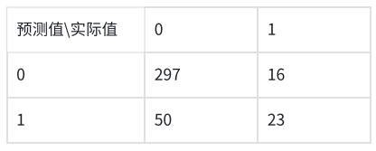   
绘制的ROC曲线如下（左：不使用逐步回归，右：使用逐步回归）:  
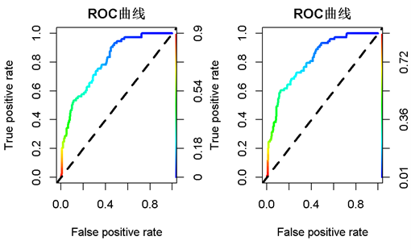    

【4.5朴素贝叶斯】  
【4.5.1建模思路】  
贝叶斯网络分类器的构建分为三个步骤。首先是数据准备阶段，事故数据和非事故数据以及相应的交通流量数据经过数据预处理后，采用随机方法确定训练集和测试集，根据文献研究，将训练集与测试集的比例设为1:1，以保证模型测试的可靠性，再通过随机欠采样将训练集中的事故数据与非事故数据的比例设为1:1。其次是分类器的训练，根据训练数据构建朴素贝叶斯网络分类器。输入是经处理后的测试数据，输出是测试样本属于各个类别的后验概率，最后根据这个概率进行分类。具体分类时，在观察得到的概率结果后，如果确定一个合适的阈值，如果属于事故数据的概率大于此值，则认为是事故数据；反之，则认为是非事故数据。    

【4.5.2建模过程】  
读取经处理后的数据，根据文献研究，以1:1的比例划分训练集和测试集，再对训练集进行随机欠采样，使得训练集中事故数据与非事故数据比值为1:1。然后，构建朴素贝叶斯模型进行训练，训练结束后输出模型评价指标，包括AUC、准确率、精确率、召回率和F1值，并绘制混淆矩阵和ROC曲线。  
高斯朴素贝叶斯可用于特征值为连续值的分类问题，虽然模型简单，但依然有很高的正确率。  
对于样本集  
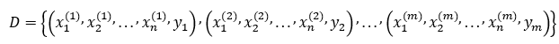    
其中m表示共有m个样本，n表示有n个特征值，  
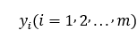   
表示样本类别，值为  
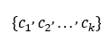   
朴素贝叶斯分类的基本公式：  
   
特征的可能性假设为高斯分布：  
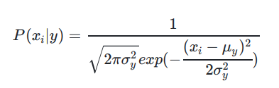   
参数σy和μy使用最大似然法估计。  
对于给出的待分类项，求解在此项出现的条件下各个类别出现的概率，此分类项的类别是概率最大的类别。也就是说，如果
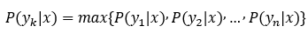   
那么x的类别是yk。  

【4.5.3建模结果】 
输出模型评价指标如下：  
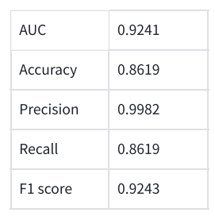   
绘制的混淆矩阵如下：  
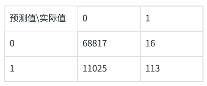   
绘制的ROC曲线如下：  
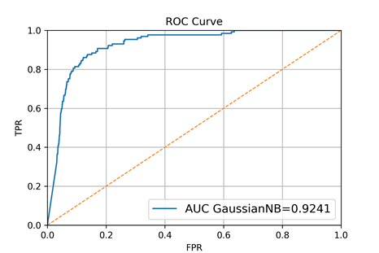    

【模型评估与应用】
---
【模型质量】  
从以上建模结果中展示的、测试集中的评估指标来对比分析的模型质量。  
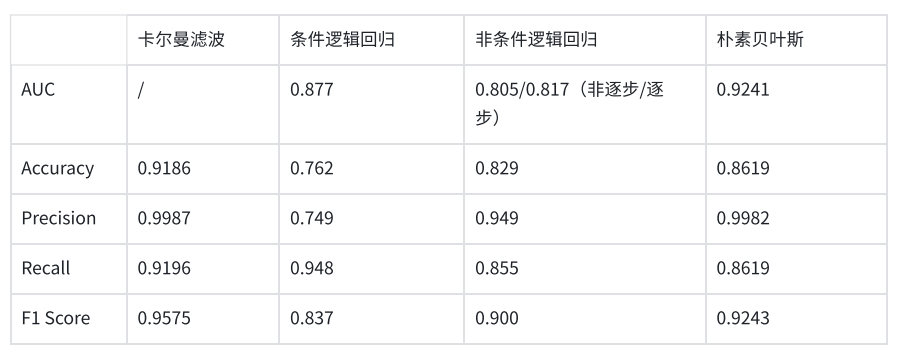   
其中非条件逻辑回归的AUC较低，而Acurracy等参数高于条件逻辑回归；相对来说，卡尔曼滤波和朴素贝叶斯模型在此问题中展现了较高的质量。  
【模型解读】  
对比这几个模型，条件逻辑回归适用于病例对照采样的情况，但在对照采样的数据集上的测试结果略逊于非条件逻辑回归，我们认为可能是在1:4采样时没有记录配对id的原因导致了这一结果。  
在AUC上条件逻辑回归的表现更好，说明条件逻辑回归在真阳率和假阳率上的表现是要优于非条件逻辑回归的。  
区别于逻辑回归，朴素贝叶斯是一个生成模型，而不是判别模型，它在训练数据中计算p(x|y)和p(y)的概率，而逻辑回归仅最大化p(y|x）的结果；此外，朴素贝叶斯的适用条件更为严格，需要x1,...xn满足条件独立，而逻辑回归并不需要；一般数据量较小的时候，朴素贝叶斯的效果更好。  
考虑到本问题的数据量并不大，且可能由于特征间的相关性较弱等，朴素贝叶斯模型展现了良好的性能。  
对于基于卡尔曼滤波实现事故的分类、预测而言，并不需要额外进行数据预处理扩展特征，直接求出经卡尔曼滤波之后的值和原始值的差值再乘占有率和阈值进行比较判断即可得到即具备“事后”分类，又具备“事前”预测的效果。不过本实验中卡尔曼方法的建模过程并不严谨，仍需要进一步研究。  

【总结与思考】  
---
【实验小结】  
1.实验过程中遇到的问题  
	在选取特征时，存在比较盲目的问题，难以找到良好的选取角度；  
	特征量偏多时，出现了过拟合的问题；  
	数据波动较大，车速和车流量的变化存在一定随机性，希望尽量减弱或消除由这种随机性产生的噪声。  
2.解决办法  
① 通过各种方法找到数据之间的关系后再进行选取，例如：通过观察可视化结果，我们认为事故前2-8分钟的数据具有较强的相关性，通过计算证实后，以事故发生前8分钟的流量和车速反差等作为新的特征入模；当然，对包含不同特征的数据集进行实验，根据模型的评估结果来决定特征的选取也是一种基本方法。  
② 通过逐步回归等方法减少特征个数；画出预测点的S型曲线来验证是否过拟合。  
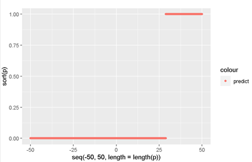    
（选取特征过多会出现如图所示的情况，拟合概率总是0或1）  
③ 查阅资料，通过卡尔曼滤波来处理噪声，达到了一定的效果，预测的精确度平均上升了2-3%.  

【文件说明】
===
## 数据集说明

1. contrast_sampled_dataset.csv 对照采样数据集
2. crash_data.csv 原数据
3. featured_dataset.csv 最终版的特征工程结果
4. traffic_data.csv 原数据

## 数据可视化（visualize）

1. visualize.py  对应pictures_1
2. visualize_2.py对应pictures_2
3. visualize_3.py对应pictures_3
4. preprocess_1.py 将is_crash添加到traffic_data, time转秒数
5. preprocess_3.py 删除缺失值
6. preprocess_2.py 提取特征
   （4.5.6做可视化用，最后的建模没有使用这个版本的特征工程）

## kalman+arima

卡尔曼滤波预处理（测试版）和时序分析

## KalmanPredict

卡尔曼滤波预处理和预测

## 非条件逻辑回归（common_logistic）

1. split_dataset.py（病例对照采样）
2. logistic.py (逻辑回归py版本，并生成r版本需要用的r_dataset.csv)
3. common_logistic.rmd（逻辑回归r版本）

## 条件逻辑回归（conditional_logistic）

1. logistic_test1.R为测试版本
2. logistic-final.R为最终建模版本

## 朴素贝叶斯（NaiveBayes)

1. NaiveBayes0106.py 最终建模版本

